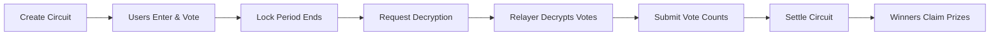
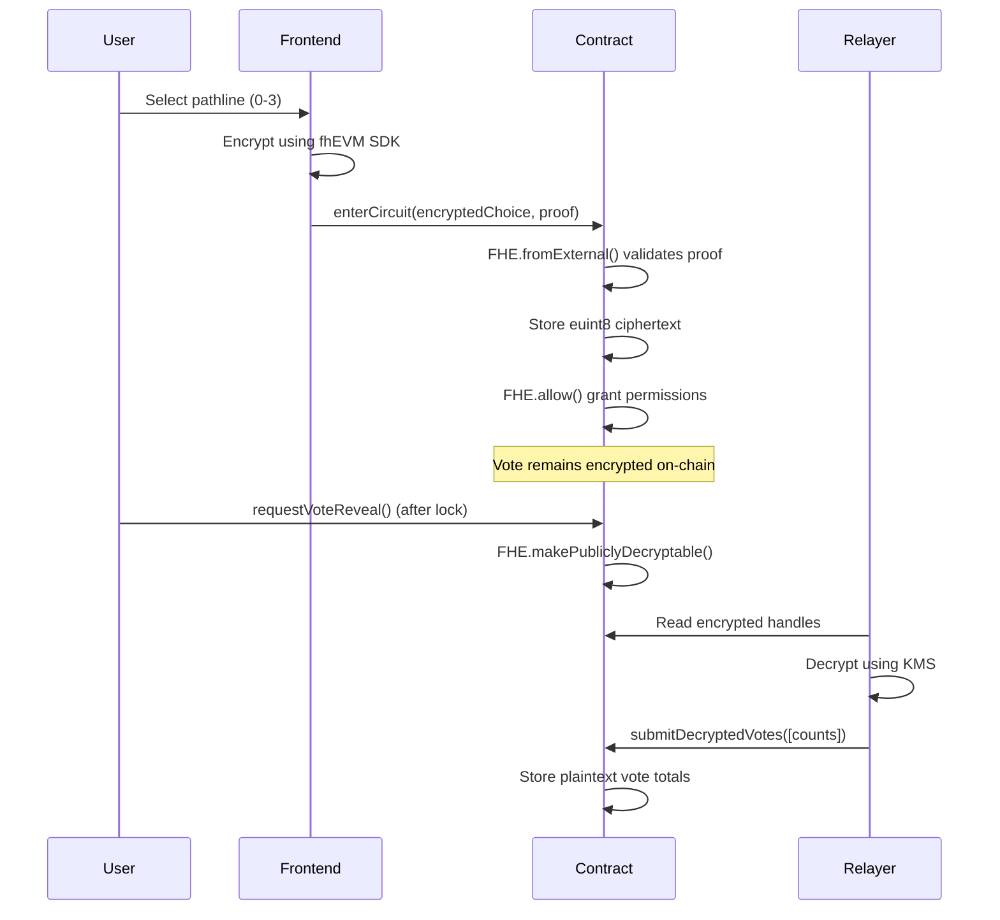
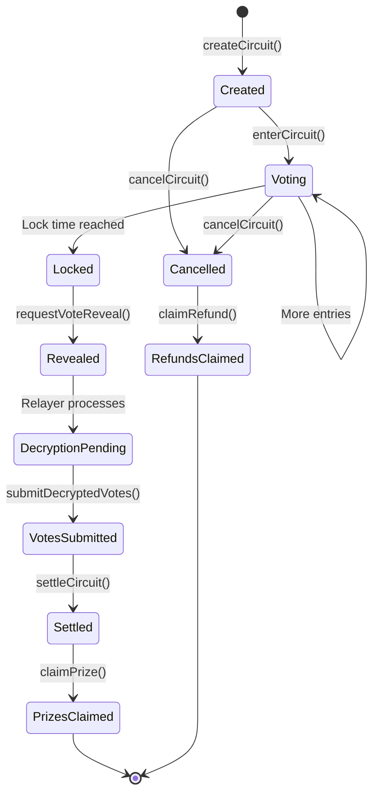

# Rift Parlay Circuit

**Privacy-Preserving Prediction Markets powered by Zama fhEVM**

A decentralized prediction market platform where users can create and participate in betting circuits with **fully encrypted votes**. Built on Zama's Fully Homomorphic Encryption (FHE) technology, ensuring complete privacy of individual predictions while enabling transparent settlement.

## 📹 Demo Video

https://github.com/user-attachments/assets/demo.mp4

> Watch the full demo showcasing encrypted voting, circuit creation, and prize settlement.

---

## 🎯 Project Overview

Rift Parlay Circuit is a next-generation prediction market built on **Zama fhEVM v0.9**, leveraging **Fully Homomorphic Encryption (FHE)** to enable:

- **Private Predictions**: User choices remain encrypted on-chain, preventing front-running and manipulation
- **Transparent Settlement**: Aggregate vote counts are publicly revealed while preserving individual privacy
- **Trustless Decryption**: Client-side decryption via Zama's Relayer SDK eliminates oracle dependencies
- **Fair Outcomes**: On-chain randomness for tie-breaking ensures provably fair results

### Why FHE Matters

Traditional prediction markets face critical privacy challenges:
- **Front-Running**: Visible votes allow others to manipulate outcomes
- **Social Pressure**: Public choices can bias participation
- **Data Leakage**: Voting patterns reveal strategic information

**Rift Parlay Circuit solves this** by performing all vote counting in encrypted space. Only when the voting period ends are the *aggregate totals* revealed—never individual choices.

---

## 🎮 How It Works

### Pathline System

Each circuit offers **four pathlines** representing different prediction outcomes:

| Pathline | Color | Description |
|----------|-------|-------------|
| **Nova** | Purple | Optimistic/bullish scenario |
| **Ember** | Orange | Steady/moderate scenario |
| **Tidal** | Blue | Volatile/mixed scenario |
| **Quake** | Green | Pessimistic/bearish scenario |

### Game Flow



#### 1. **Circuit Creation**
- Anyone can create a prediction market with:
  - Custom headline/question
  - Duration (10 minutes to 96 hours)
  - Entry fee ≥ 0.0004 ETH (demo: free)
- Circuit receives unique ID and four encrypted vote counters

#### 2. **Encrypted Entry**
- Users select a pathline (Nova/Ember/Tidal/Quake)
- Frontend encrypts choice using Zama fhEVM SDK
- Encrypted vote is submitted on-chain with ZK proof
- Each user can only vote once per circuit

#### 3. **Voting Period**
- All votes remain fully encrypted
- Vote counts accumulate in encrypted space using `FHE.add()`
- No one (including contract creator) can see individual choices
- Prevents strategic voting and manipulation

#### 4. **Vote Revelation**
- After lock time, anyone triggers `requestVoteReveal()`
- Contract marks encrypted votes for public decryption
- Off-chain relayer decrypts using `@zama-fhe/relayer-sdk`
- Relayer submits plaintext vote counts back to contract

#### 5. **Settlement**
- Contract determines winning pathline with most votes
- Tie-breaking uses on-chain randomness (blockhash)
- Winners split prize pool equally
- If no votes, all participants get refunds

---

## 🏗️ Smart Contract Architecture

### Contract Structure

```
RiftParlayCircuit (ZamaEthereumConfig)
│
├── Circuit Management
│   ├── createCircuit()      // Create new prediction market
│   ├── cancelCircuit()      // Creator cancels before settlement
│   └── settleCircuit()      // Determine winner after reveal
│
├── Encrypted Voting
│   ├── enterCircuit()       // Submit encrypted vote + proof
│   ├── requestVoteReveal()  // Mark votes for decryption
│   └── submitDecryptedVotes() // Relayer submits plaintext counts
│
├── Prize Distribution
│   ├── claimPrize()        // Winners claim share of pool
│   └── claimRefund()       // Get refund if circuit cancelled
│
└── Data Queries
    ├── getCircuit()        // View circuit details
    ├── listCircuitIds()    // All circuit IDs
    ├── hasEntered()        // Check if user voted
    └── getUserChoice()     // Get encrypted choice (bytes32)
```

### Core Data Structures

```solidity
struct Circuit {
    bool exists;
    string circuitId;           // Unique identifier
    string headline;            // Prediction question
    address creator;            // Who created it
    uint256 lockTime;           // When voting ends
    bool cancelled;             // Creator cancelled
    bool settled;               // Winner determined
    bool pushAll;               // Full refund mode
    uint8 winningPathline;      // Winner (0-3)
    uint8[4] revealedVotes;     // Decrypted vote counts
    address[] entrants;         // All participants
}

struct Entry {
    bool exists;
    euint8 encryptedChoice;     // FHE-encrypted vote (0-3)
}
```

### State Mappings

```solidity
mapping(string => Circuit) private _circuits;              // circuitId => Circuit
mapping(string => mapping(address => Entry)) private _entries;  // circuitId => user => Entry
string[] private _circuitIds;                              // All circuit IDs
```

---

## 🔐 FHE Implementation Deep Dive

### Encryption Flow



### Key FHE Operations

#### 1. **Client-Side Encryption**
```typescript
// Frontend (using Zama RelayerSDK)
import { createInstance } from '@zama-fhe/relayer-sdk';

const instance = await createInstance({
  network: ethereum,
  config: SepoliaConfig
});

const input = instance.createEncryptedInput(
  contractAddress,  // 0x0e319661627836c18bd6CA2A2500f80B2478d32c
  userAddress
);

input.add8(pathlineChoice);  // 0 = Nova, 1 = Ember, 2 = Tidal, 3 = Quake

const { handles, inputProof } = await input.encrypt();
```

#### 2. **On-Chain Validation**
```solidity
// Contract receives encrypted data
function enterCircuit(
    string calldata circuitId,
    externalEuint8 encryptedChoice,  // Encrypted input
    bytes calldata proof              // Zero-knowledge proof
) external {
    // Validate and import encrypted data
    euint8 choice = FHE.fromExternal(encryptedChoice, proof);

    // Store in encrypted space
    entry.encryptedChoice = choice;

    // Grant access permissions
    FHE.allow(choice, msg.sender);    // User can read own choice
    FHE.allowThis(choice);            // Contract can compute on it
}
```

#### 3. **Encrypted Vote Counting**
```solidity
// Aggregation happens in encrypted space (pseudo-code)
euint8 totalVotes = FHE.constant8(0);
for (uint i = 0; i < entrants.length; i++) {
    euint8 userChoice = entries[entrants[i]].encryptedChoice;
    // Each pathline accumulates votes if choice matches
    totalVotes = FHE.add(totalVotes,
        FHE.select(FHE.eq(userChoice, pathlineIndex), 1, 0)
    );
}
```

#### 4. **Public Decryption**
```solidity
// After lock time, mark for decryption
function requestVoteReveal(string calldata circuitId) external {
    for (uint i = 0; i < circuit.entrants.length; i++) {
        Entry storage entry = entries[circuit.entrants[i]];
        // Makes this ciphertext publicly decryptable
        FHE.makePubliclyDecryptable(entry.encryptedChoice);
    }
}
```

#### 5. **Relayer Decryption**
```typescript
// Off-chain relayer decrypts
const { publicClient } = createRelayerClient({ network: 'sepolia' });

// Get encrypted handles from events
const handles = await getEncryptedHandles(circuitId);

// Decrypt via KMS
const decryptedVotes = await Promise.all(
  handles.map(h => publicClient.decrypt(h))
);

// Submit plaintext back to contract
await contract.submitDecryptedVotes(circuitId, decryptedVotes);
```

### FHE Security Properties

| Property | Implementation | Benefit |
|----------|---------------|---------|
| **Confidentiality** | AES-128 equivalent encryption | Individual votes never revealed |
| **Computation on Ciphertext** | FHE arithmetic operations | Vote counting without decryption |
| **Access Control** | `FHE.allow()` permissions | Only authorized parties read data |
| **Proof Verification** | ZK proofs on `FHE.fromExternal()` | Prevents invalid ciphertext injection |
| **Selective Disclosure** | `makePubliclyDecryptable()` | Only aggregates revealed, not individuals |

---

## 🔄 Contract Lifecycle

### State Transitions



### Validation Rules

| Phase | Allowed Actions | Restrictions |
|-------|----------------|--------------|
| **Created** | `enterCircuit`, `cancelCircuit` | Must be before lock time |
| **Locked** | `requestVoteReveal`, `settleCircuit` | After lock time |
| **Revealed** | `submitDecryptedVotes` | Only relayer submits |
| **Settled** | `claimPrize`, `claimRefund` | Based on winner status |
| **Cancelled** | `claimRefund` | All participants get refund |

---

## 🛠️ Technical Stack

### Smart Contracts
- **Solidity**: `^0.8.24`
- **fhEVM**: `@fhevm/solidity@0.9.1`
- **Network**: Ethereum Sepolia Testnet
- **Inheritance**: `ZamaEthereumConfig` for FHE setup

### Frontend
- **Framework**: React 18 + TypeScript + Vite
- **Web3**: Wagmi v2 + RainbowKit
- **FHE SDK**: `@zama-fhe/relayer-sdk@0.3.0-5` (CDN)
- **UI**: Tailwind CSS + shadcn/ui + Framer Motion
- **Deployment**: Vercel

### Key Dependencies
```json
{
  "contracts": {
    "@fhevm/solidity": "^0.9.1",
    "@fhevm/hardhat-plugin": "^0.1.0"
  },
  "frontend": {
    "wagmi": "^2.x",
    "@rainbow-me/rainbowkit": "^2.x",
    "viem": "^2.x"
  }
}
```

---

## 📦 Deployment Information

### Contract Address
```
Sepolia: 0x0e319661627836c18bd6CA2A2500f80B2478d32c
```
[View on Etherscan](https://sepolia.etherscan.io/address/0x0e319661627836c18bd6CA2A2500f80B2478d32c)

### Live Demo
```
https://riftparlaycircuit-pqp7y64b2-songsus-projects.vercel.app
```

### Network Configuration
```javascript
{
  network: "sepolia",
  chainId: 11155111,
  rpcUrl: "https://ethereum-sepolia-rpc.publicnode.com",
  fheConfig: {
    aclAddress: "0xf0Ffdc93b7E186bC2f8CB3dAA75D86d1930A433D",
    coprocessorAddress: "0x92C920834Ec8941d2C77D188936E1f7A6f49c127",
    kmsVerifierAddress: "0xbE0E383937d564D7FF0BC3b46c51f0bF8d5C311A"
  }
}
```

---

## 🚀 Getting Started

### Prerequisites
```bash
node >= 18.x
npm >= 9.x
```

### Installation

```bash
# Clone repository
git clone https://github.com/yourusername/RiftParlayCircuit
cd RiftParlayCircuit

# Install contract dependencies
npm install

# Install frontend dependencies
cd frontend
npm install
```

### Local Development

#### 1. Compile Contracts
```bash
npx hardhat compile
```

#### 2. Run Tests
```bash
npx hardhat test
```

#### 3. Deploy to Sepolia
```bash
# Set environment variables
export SEPOLIA_RPC_URL="https://ethereum-sepolia-rpc.publicnode.com"
export PRIVATE_KEY="your_private_key"
export STAKE_TOKEN="0x7ABDC2FF0966359e327Ef8f749fBB659eE2ba59C"

# Deploy contract
npx hardhat run scripts/deploy.js --network sepolia

# Seed demo circuits
SEPOLIA_RPC_URL=$SEPOLIA_RPC_URL \
PRIVATE_KEY=$PRIVATE_KEY \
npx hardhat run scripts/create-demo-circuits.cjs --network sepolia
```

#### 4. Run Frontend
```bash
cd frontend
npm run dev
# Opens http://localhost:5173
```

---

## 📊 Contract Events

### CircuitCreated
```solidity
event CircuitCreated(
    string indexed circuitId,
    string headline,
    uint256 lockTime
);
```
Emitted when new prediction market is created.

### EntryPlaced
```solidity
event EntryPlaced(
    string indexed circuitId,
    address indexed player
);
```
Emitted when user submits encrypted vote.

### VotesRevealed
```solidity
event VotesRevealed(
    string indexed circuitId,
    uint8[4] votes  // [Nova, Ember, Tidal, Quake]
);
```
Emitted when relayer submits decrypted vote counts.

### CircuitSettled
```solidity
event CircuitSettled(
    string indexed circuitId,
    bool pushAll,
    uint8 winningPathline
);
```
Emitted when winner is determined.

### CircuitCancelled
```solidity
event CircuitCancelled(
    string indexed circuitId
);
```
Emitted when creator cancels circuit.

---

## 🔬 Advanced Topics

### Gas Optimization

FHE operations are computationally expensive. Optimizations include:

1. **Minimal Encrypted Data**: Use `euint8` instead of `euint64` for votes
2. **Batch Decryption**: Relayer decrypts all votes in single call
3. **Lazy Settlement**: Votes only revealed when needed
4. **Access Control**: `FHE.allow()` minimizes permission overhead

### Security Considerations

#### ✅ Mitigated Risks
- **Front-Running**: Encrypted votes prevent MEV attacks
- **Vote Manipulation**: FHE ensures votes can't be changed after submission
- **Sybil Attacks**: One vote per address enforced on-chain
- **Re-entrancy**: State changes before external calls (CEI pattern)

#### ⚠️ Current Limitations
- **Relayer Trust**: Demo trusts relayer to submit correct decryptions
  - *Production Fix*: Add signature verification using `FHE.verifySignatures()`
- **Randomness**: Uses `blockhash` for tie-breaking
  - *Acceptable*: For demo/low-stakes; production should use VRF
- **Finality**: Decryption requires off-chain relayer
  - *Design Trade-off*: Eliminates oracle fees while maintaining privacy

### Scalability

Current implementation handles:
- **Unlimited Circuits**: No global limit
- **Unlimited Participants**: Per-circuit unbounded
- **Gas Costs**: ~150k gas per encrypted vote (Sepolia)

For production:
- Implement pagination for large participant lists
- Consider L2 deployment (zkSync, Optimism) for lower costs
- Use subgraph for efficient frontend queries

---

## 🧪 Testing

### Unit Tests
```bash
npx hardhat test
```

### Integration Tests
```typescript
// Test encrypted voting flow
describe("Encrypted Voting", () => {
  it("should accept encrypted vote with valid proof", async () => {
    const { contract, user, circuitId } = await setup();

    // Encrypt choice
    const choice = 2; // Tidal
    const { handle, proof } = await encryptChoice(choice, user.address);

    // Submit
    await contract.connect(user).enterCircuit(circuitId, handle, proof);

    // Verify entry recorded
    expect(await contract.hasEntered(circuitId, user.address)).to.be.true;
  });
});
```

### Manual Testing
1. Create circuit on frontend
2. Multiple users vote with different wallets
3. Wait for lock time
4. Trigger `requestVoteReveal()`
5. Run relayer script to decrypt
6. Settle circuit and verify winners

---

## 📖 API Reference

### Read Functions

#### `getCircuit(circuitId)`
Returns circuit details including vote counts after revelation.

**Returns:**
```solidity
struct CircuitSnapshot {
    bool exists;
    string circuitId;
    string headline;
    address creator;
    uint256 lockTime;
    bool cancelled;
    bool settled;
    bool pushAll;
    uint8 winningPathline;
    uint8[4] revealedVotes;
    uint256 totalEntrants;
}
```

#### `listCircuitIds()`
Returns array of all circuit IDs.

#### `hasEntered(circuitId, user)`
Check if address has voted in circuit.

#### `getUserChoice(circuitId, user)`
Get encrypted choice as `bytes32` (requires `FHE.allow()` permission).

### Write Functions

#### `createCircuit(circuitId, headline, duration)`
Create new prediction market.

**Parameters:**
- `circuitId`: Unique string identifier
- `headline`: Prediction question
- `duration`: Seconds until lock (10 min - 96 hours)

#### `enterCircuit(circuitId, encryptedChoice, proof)`
Submit encrypted vote.

**Parameters:**
- `circuitId`: Circuit to enter
- `encryptedChoice`: FHE-encrypted pathline (0-3)
- `proof`: Zero-knowledge proof from SDK

#### `requestVoteReveal(circuitId)`
Mark encrypted votes for public decryption (after lock).

#### `submitDecryptedVotes(circuitId, votes)`
Relayer submits plaintext vote counts.

**Parameters:**
- `votes`: `uint8[4]` array of counts `[Nova, Ember, Tidal, Quake]`

#### `settleCircuit(circuitId)`
Determine winner based on revealed votes.

#### `claimPrize(circuitId)`
Winners claim share of prize pool.

#### `claimRefund(circuitId)`
Get refund if circuit cancelled or no votes.

---

## 🤝 Contributing

We welcome contributions! Please see:

1. Fork repository
2. Create feature branch (`git checkout -b feature/amazing`)
3. Commit changes (`git commit -m 'Add amazing feature'`)
4. Push to branch (`git push origin feature/amazing`)
5. Open Pull Request

### Development Guidelines
- Follow Solidity style guide
- Add tests for new features
- Update documentation
- Verify gas optimizations

---

## 📄 License

MIT License - see [LICENSE](LICENSE) file for details.

---

## 🙏 Acknowledgments

- **Zama** - For pioneering FHE technology and fhEVM framework
- **Ethereum Foundation** - Sepolia testnet infrastructure
- **shadcn/ui** - Beautiful component library
- **Vercel** - Deployment platform

---

## 📞 Contact & Resources

- **Website**: https://riftparlaycircuit-pqp7y64b2-songsus-projects.vercel.app
- **Contract**: https://sepolia.etherscan.io/address/0x0e319661627836c18bd6CA2A2500f80B2478d32c
- **Zama Docs**: https://docs.zama.ai/fhevm
- **fhEVM GitHub**: https://github.com/zama-ai/fhevm

---

## 🔮 Future Roadmap

- [ ] **Multi-outcome Markets**: Support >4 pathlines per circuit
- [ ] **Time-weighted Voting**: Early voters get multipliers
- [ ] **NFT Receipts**: Mint proof-of-participation NFTs
- [ ] **DAO Governance**: Community-controlled circuit parameters
- [ ] **L2 Deployment**: Lower gas costs on Optimism/Arbitrum
- [ ] **Mobile App**: React Native frontend
- [ ] **Oracle Integration**: Automated settlement based on real-world data
- [ ] **Staking Rewards**: Earn yield while circuits are active

---

**Built with 🔐 by the Rift Parlay Team**

*"Privacy-preserving predictions for a transparent future"*
